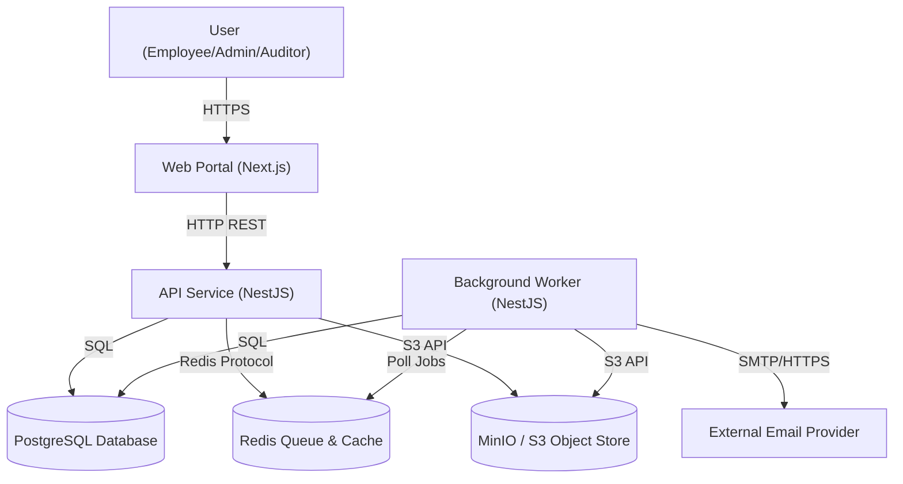
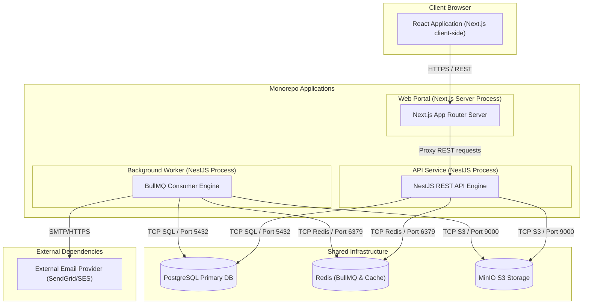

# Technical Architecture Design

This document details the authoritative high-level technical architecture for **AssetFlow**. It is designed specifically for engineers, developers, and platform administrators deploying, maintaining, and extending this monorepo codebase.

---

## 1. Purpose and Audience

This document establishes the architectural blueprints, boundaries, invariants, and implementation patterns for the AssetFlow platform. It serves as:
- An **onboarding guide** for new engineering contributors.
- An **operations reference** for infrastructure deployment and scaling decisions.
- A **security control guide** outlining trust boundaries and multi-tenancy isolation guarantees.

---

## 2. Architectural Drivers

AssetFlow is governed by a set of non-negotiable architectural requirements:
*   **Strict Tenant Isolation:** Multi-tenancy is active across all data storage, caching, and background compute layers. Data must never leak between tenants under any operational circumstance.
*   **No Double Allocation:** An active physical asset must never be concurrently assigned to more than one employee or department.
*   **No Overlapping Bookings:** Shared resource reservations (e.g. vehicles or rooms) must never overlap in time. Booking intervals are evaluated as half-open ranges `[start, end)`.
*   **Auditable Workflow History:** The lifecycle of assets, allocations, bookings, maintenance, and audits must be tracked in an append-only log. Editing or deleting history is strictly prohibited.
*   **Reliable Asynchronous Tasks:** Non-blocking operations (such as emails, push notifications, and analytics runs) must run asynchronously. Failure of notifications must not block or roll back the primary database transaction of a business action.
*   **Recoverability:** The system must support Point-in-Time Recovery (PITR) to guarantee minimal Data Loss (RPO) and Downtime (RTO) under disaster conditions.
*   **Maintainable Modular Boundaries:** Sibling feature areas (e.g., allocations and maintenance) must remain decoupled. Cross-module writes are strictly prohibited.

---

## 3. System Context

The context diagram below illustrates the external actors and external dependencies interacting with the AssetFlow system.



---

## 4. Container & Runtime Architecture

AssetFlow runs as three independent services that communicate with shared infrastructure:



---

## 5. Modular Monolith Rationale

AssetFlow is structured as a **modular monolith** rather than distributed microservices for several reasons:
- **Simplified Local Development:** The entire application runs inside a single repository with shared TypeScript interfaces, removing the need to manage container networks and service meshes locally.
- **Transactional Consistency:** Critical multi-table state changes (such as write operations and outbox records) are committed within a single local transaction, eliminating the need for complex distributed transaction protocols (Saga, 2PC).
- **Reduced Network Overhead:** Inner-module communication occurs via in-memory interfaces rather than network serialization (HTTP/gRPC).

### Service Extraction Criteria
Splitting modular monolith segments into independent network services (microservices) will only be considered when:
1.  **Database Bottlenecks:** A specific module demands write performance that exhausts PostgreSQL thread limits, requiring dedicated database scaling.
2.  **Resource Contention:** Heavy CPU-bound processes (e.g., report compiling or image virus checks) disrupt the low-latency response times of user-facing HTTP endpoints.
3.  **Team Boundaries:** The product scales to a size where independent deployment pipelines are needed for separate development teams.

---

## 6. Module Map & Responsibilities

The system is organized into the following modules inside `apps/api/src/modules/`:

| Module Name | Core Responsibility | Key Invariant / Constraint |
|---|---|---|
| **`identity-access`** | Auth, login/logout, JWT generation, RBAC rules, employee signup. | Signup creates `EMPLOYEE` role only. Administrator must manually promote members. |
| **`organization`** | Department, tenant config, locations, categories. | `tenant_id` must match authenticated token context. |
| **`asset-registry`** | Serialization and status machine tracker for physical assets. | Hard deletes are forbidden. Disposed state is terminal. |
| **`allocation`** | Assigning, transferring, and returning assets. | An asset can have at maximum **one** active allocation record. |
| **`resource-booking`** | Time-bound reservation of shared assets. | Overlapping bookings are prevented by PostgreSQL exclusion constraints. |
| **`maintenance`** | Maintenance workflows (SUBMITTED, APPROVED, IN_REPAIR, COMPLETED). | Transitioning to repair changes asset state to `UNDER_MAINTENANCE`. |
| **`audit`** | Compliance audit cycles, discrepancy logs, and verification checks. | Once an audit cycle is closed, it is immutable. Corrections require new logs. |
| **`notifications`** | Email, SMS, and in-app system messaging routing. | Failure to send an email must never roll back a database transaction. |
| **`reporting`** | KPI dashboards, usage stats, file downloads, and data exports. | Reads are executed against replica nodes (or cache) to avoid Primary locks. |
| **`activity-log`** | Audit trail tracker for security, compliance, and user actions. | Append-only. There are no update or delete routes for logs. |

---

## 7. Dependency Rules

The monorepo enforces architectural isolation between layers to prevent circular dependencies and framework leakages:

```
┌────────────────────────────────────────────────────────┐
│                   Transport / UI Layer                 │
│         (apps/web Next.js Controllers, apps/api)       │
└───────────────────────────┬────────────────────────────┘
                            │ imports
┌───────────────────────────▼────────────────────────────┐
│                    Application Services                │
│                 (NestJS modules, Use cases)            │
└───────────────────────────┬────────────────────────────┘
                            │ imports
┌───────────────────────────▼────────────────────────────┐
│                       Domain Layer                     │
│                 (packages/domain aggregates)           │
└───────────────────────────▲────────────────────────────┘
                            │ implements ports
┌───────────────────────────┴────────────────────────────┐
│                   Infrastructure Layer                 │
│      (packages/database, packages/queue implementations)│
└────────────────────────────────────────────────────────┘
```

*   **Domain Layer (`packages/domain`):** Free of external framework dependencies (NestJS, Prisma). Contains pure entities, value objects, and repository port definitions.
*   **Infrastructure Layer:** Implements adapters defined by the domain layer. Imports Prisma and BullMQ.
*   **No Direct Cross-Module Dependencies:** Module directory boundaries inside `apps/api/src/modules/` are strict. Sibling modules must interact using domain events or declared dependency injection ports.

---

## 8. Data Ownership Rules

*   **Single-Writer Principle:** Each table in the PostgreSQL database is owned by exactly **one** module. Sibling modules are forbidden from writing to tables they do not own.
*   **Foreign Keys across Modules:** Cross-module references are maintained via logical ID fields only (no foreign key constraints across domain database tables to allow eventual microservice extraction).
*   **Read-Only Integration:** A module may perform read queries on sibling schemas via specific read views, but write operations are prohibited.

---

## 9. Transaction Boundaries

All operations within a boundary commit or roll back together. Cross-module orchestration uses outbox patterns.

### Asset Allocation
1.  Verify asset status is `AVAILABLE` and employee exists.
2.  Write new `Allocation` record.
3.  Set Asset status to `ALLOCATED`.
4.  Write transactional `Outbox` event.
5.  Commit (single SQL transaction).

### Transfer Completion
1.  Verify target employee.
2.  Deactivate current active allocation record.
3.  Write new active allocation for target employee.
4.  Write outbox event.
5.  Commit.

### Return Acceptance
1.  Verify active allocation.
2.  Mark active allocation as returned.
3.  Change Asset state back to `AVAILABLE`.
4.  Write outbox event.
5.  Commit.

### Booking Creation
1.  Verify resource exists.
2.  Insert `Booking` record with half-open range checks `[start, end)`.
3.  Commit.

### Maintenance Approval
1.  Verify request is in `SUBMITTED` state.
2.  Update request state to `APPROVED`.
3.  Set Asset state to `UNDER_MAINTENANCE`.
4.  Write outbox event.
5.  Commit.

### Audit Cycle Closure
1.  Verify cycle is active.
2.  Calculate discrepancies.
3.  Set cycle state to `CLOSED`.
4.  Remove temporary auditor scope assignments.
5.  Write outbox event.
6.  Commit.

---

## 10. Concurrency Strategy

To guarantee data consistency, AssetFlow implements concurrent write protection across layers:
*   **PostgreSQL Constraints:** 
    *   Exclusion constraints (`gist` index using `tsrange`) prevent overlapping booking ranges:
        ```sql
        ALTER TABLE "Booking" ADD CONSTRAINT "no_overlapping_bookings"
        EXCLUDE USING gist (resource_id WITH =, time_range WITH &&);
        ```
    *   Partial unique constraints prevent double allocation of assets:
        ```sql
        CREATE UNIQUE INDEX "single_active_allocation" 
        ON "Allocation" (asset_id) WHERE status = 'ACTIVE';
        ```
*   **Row-Level Locks:** For operational edits (like allocation transfers), processes acquire explicit row locks via `SELECT ... FOR UPDATE` to block race conditions.
*   **Optimistic Versioning:** Every core database model has a `version` (integer) column. Updates evaluate version matches:
    ```sql
    UPDATE "Asset" SET status = 'ALLOCATED', version = version + 1 
    WHERE id = :id AND version = :version;
    ```
*   **Idempotency Keys:** Mutating API endpoints require an `X-Idempotency-Key` header. Requests are tracked in Redis with a short TTL to prevent double execution.

---

## 11. Multi-Tenancy Model

AssetFlow implements a **shared-database, shared-schema** multi-tenant model.

*   **Tenant ID Isolation:** All tenant-owned tables include a non-nullable `tenant_id` field.
*   **Query Filtering:** Query scopes must append a tenant filter derived from the user's active session token:
    ```typescript
    where: { tenantId: req.user.tenantId }
    ```
*   **Tenant-Aware Caching:** Cache entries, queue jobs, and storage prefixes are namespace-scoped:
    *   *Cache Keys:* `tenant:<tenantId>:asset:<assetId>`
    *   *S3 Path Prefix:* `uploads/tenant_<tenantId>/...`
*   **Defense in Depth:** PostreSQL Row-Level Security (RLS) policies will be introduced in future database migrations as an operational constraint.

---

## 12. Event Architecture

Asynchronous module operations utilize the Transactional Outbox pattern:

```
[ NestJS API Transaction ]
┌──────────────────────────────┐
│  1. Mutate State (e.g. Booking)│
│  2. Insert Event into Outbox │
└──────────────┬───────────────┘
               │ Commit
               ▼
┌──────────────────────────────┐
│      Postgres Database       │
│  ┌────────────────────────┐  │
│  │ Table: Booking         │  │
│  │ Table: Outbox          │  │
│  └───────────┬────────────┘  │
└──────────────┼───────────────┘
               │ Poll / Stream (outbox-worker)
               ▼
┌──────────────────────────────┐
│        NestJS Worker         │
│  1. Publish to Redis Queue   │
│  2. Mark Outbox as Sent      │
└──────────────┬───────────────┘
               │ Dispatch
               ▼
┌──────────────────────────────┐
│     Idempotent Consumer      │
│  - Verify event_id is new    │
│  - Execute side-effect       │
└──────────────────────────────┘
```

*   **Reliable Outbox Delivery:** Outbox rows commit in the same local transaction as the database change.
*   **Worker Dispatcher:** A background worker reads the outbox table and publishes events to Redis.
*   **Idempotency Checks:** Consumers verify the unique event ID in Redis before executing business effects.
*   **Dead-Letter Handling:** Failed queue jobs are retried up to 5 times with exponential backoff before being placed in a dead-letter queue (DLQ) for operator intervention.
*   **Envelope Versioning:** Event formats include a version number to allow schema evolution:
    ```json
    {
      "eventId": "uuid-v4",
      "eventType": "asset.allocated",
      "eventVersion": 1,
      "tenantId": "tenant-uuid",
      "payload": { ... }
    }
    ```

---

## 13. File-Upload Architecture

Direct uploads through the API process are blocked. AssetFlow uses pre-signed storage coordinates:

1.  **Pre-signed Request:** Client requests an upload permission link. The API validates authorization and returns a pre-signed S3 upload URL with a 5-minute expiry.
2.  **Direct S3 Upload:** Client uploads the file directly to MinIO/S3 using the signed URL. The file is placed in a quarantined folder: `uploads/quarantine/tenant_<id>/`.
3.  **Scanning and Processing (Future):** An asynchronous worker is triggered to perform size checks, extension validation, and virus scanning (planned scan integration).
4.  **Promoting to Storage:** Upon successful validation, the file is promoted to `uploads/active/tenant_<id>/`.
5.  **Secure Download:** Files are never exposed publicly. Access is granted through short-lived (e.g., 15-minute) pre-signed download URLs.

---

## 14. Authentication & Authorization

*   **Employee-Only Signups:** Public signups default strictly to the lowest-privilege `EMPLOYEE` role.
*   **Bootstrap Administrator:** A single administrative user is created at setup using a protected `ADMIN_BOOTSTRAP_SECRET` environment variable.
*   **Role-Based Access Control (RBAC):** Privileges are mapped to specific roles: `ADMIN`, `ASSET_MANAGER`, `DEPARTMENT_HEAD`, and `EMPLOYEE`.
*   **Temporary Scoped Access:** The `AUDITOR` role is not a global assignment. It is dynamically assigned to a user for the scope of a single audit cycle and expires automatically when that cycle is closed.

---

## 15. Observability

*   **Structured Logs:** Log outputs must write structured JSON formats containing standard keys (`timestamp`, `level`, `service`, `tenantId`, `correlationId`).
*   **Metrics:** Real-time business indicators (e.g., active allocations, pending maintenance tickets, queue size) are collected for Grafana visualization.
*   **Traces:** Distributed spans track execution across Next.js, the NestJS API, and background workers using OpenTelemetry W3C header propagation.
*   **Correlation IDs:** Every API request generates a correlation ID. This ID is passed to background workers and log contexts to track errors across runtime processes.

---

## 16. Failure Handling & Degradation

| Service / Dependency | Failure Mode | Impact | Recovery / Mitigation |
|---|---|---|---|
| **Redis** | Offline | Queue halts, caching disabled. | API continues to handle synchronous reads/writes. Outbox logs remain in PostgreSQL. Jobs run once Redis restores. |
| **S3 (MinIO)** | Offline | File uploads/downloads fail. | API returns `503 Service Unavailable` for file endpoints. DB writes remain operational. |
| **Email Provider** | Offline | Delivery failures. | Worker logs fail, retrying up to 5 times. Primary transactions are unaffected. |
| **PostgreSQL replica** | Offline | Reports fail or degrade. | API routes read queries to the Primary instance until replication restores. |

---

## 17. Disaster Recovery Expectations

*   **Database Backup:** Daily snapshots are stored in a separate, isolated S3 bucket with a 30-day retention cycle.
*   **Point-in-Time Recovery (PITR):** Write-Ahead Logs (WAL) are shipped hourly to support database restoration to within 1 hour of any failure event.
*   **Disaster Targets:**
    *   *Recovery Point Objective (RPO):* `< 1 hour` (maximum data loss).
    *   *Recovery Time Objective (RTO):* `< 4 hours` (system restoration timeline).

---

## 18. Scaling Strategy

*   **Stateless Processes:** The API and Worker instances contain no local session state, allowing them to scale horizontally behind load balancers.
*   **Primary/Replica Split:** Write requests target the primary PostgreSQL instance. Heavy reports, analytics, and exporting queries target read replicas.
*   **Materialized Views:** Daily reporting metrics are stored in PostgreSQL materialized views, updated periodically in the background.

---

## 19. Security Assumptions & Trust Boundaries

*   **API Trust:** The database, Redis instance, and MinIO storage reside inside a private subnet. The API acts as the gatekeeper.
*   **Network Boundaries:** External clients are not permitted to query PostgreSQL, Redis, or MinIO directly.
*   **Token Verification:** JWT validation occurs on the API. Sibling modules assume the incoming `User` context is correct after middleware verification.

---

## 20. Risks & Deferred Decisions

*   **Row-Level Security (RLS) Timing:** Implementing RLS in Prisma requires custom schema setups. This complexity is deferred to a future phase.
*   **Malware Scan Engine:** The selection of a virus scanner engine (e.g., ClamAV) is deferred. The quarantine directory structure is implemented to support this addition later.
*   **SSO Integration:** Integration with SAML/OIDC providers is deferred. The architecture uses standard local JWT credential authentication for the initial scaffold.

---

## 21. Documentation Index

For deeper specifications, refer to the following documents:
*   [API schema design and routing](./docs/api/README.md)
*   [Database models and schema details](./docs/data/README.md)
*   [Core domain logic definitions](./docs/domain/README.md)
*   [Engineering and style guide](./docs/engineering/README.md)
*   [Security definitions and keys setup](./docs/security/README.md)
*   [Event payloads and outbox schema](./docs/events/README.md)
*   [Operations and deployment runs](./docs/operations/README.md)
*   [Architecture Decisions Log (ADRs)](./docs/adr/README.md)
