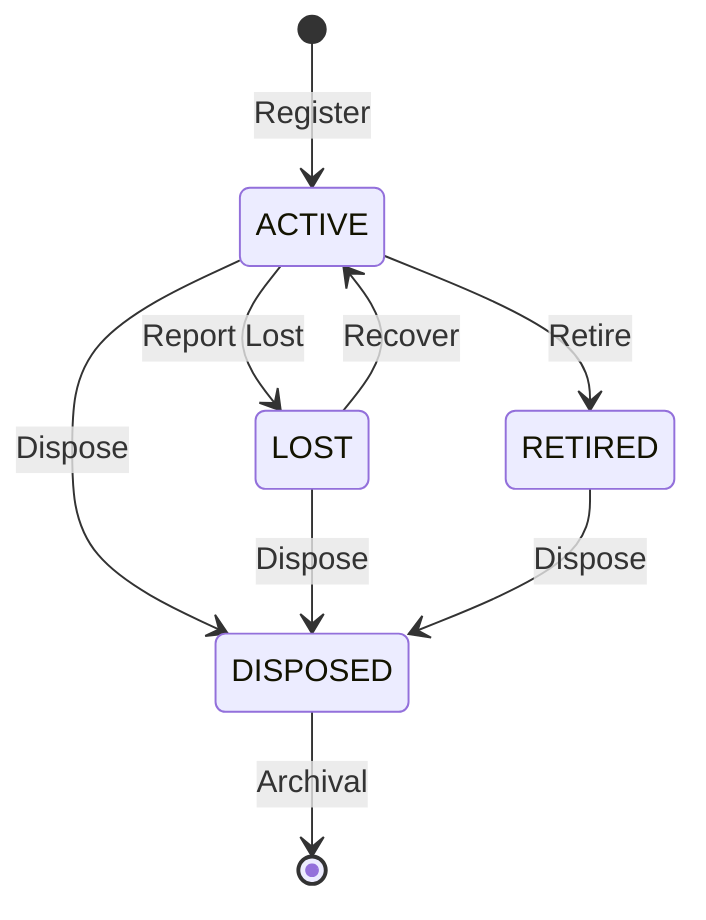
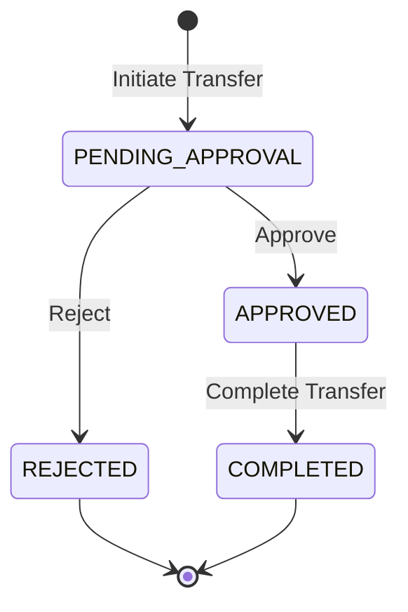
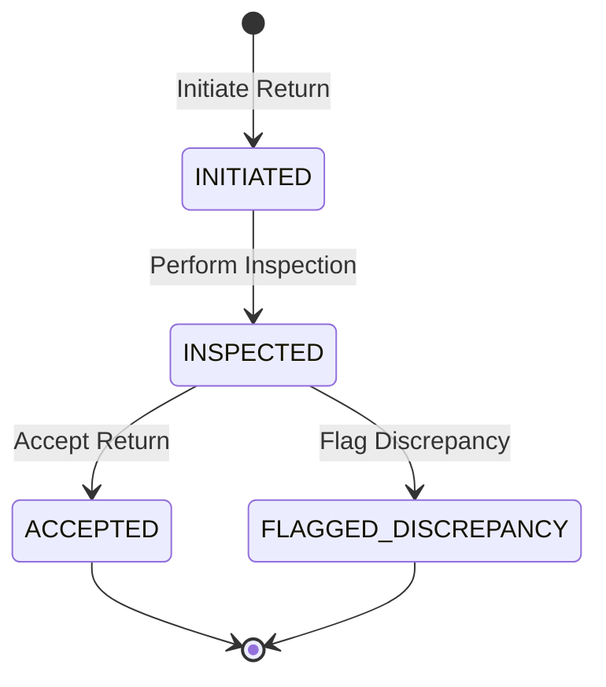
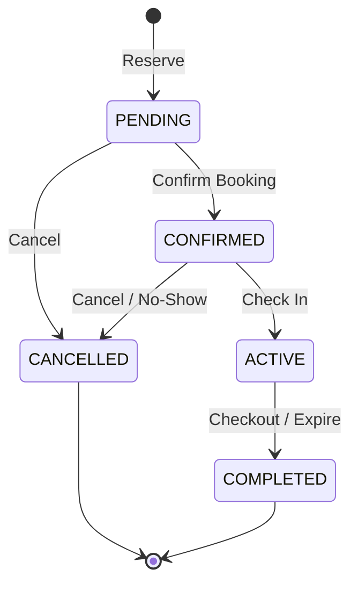
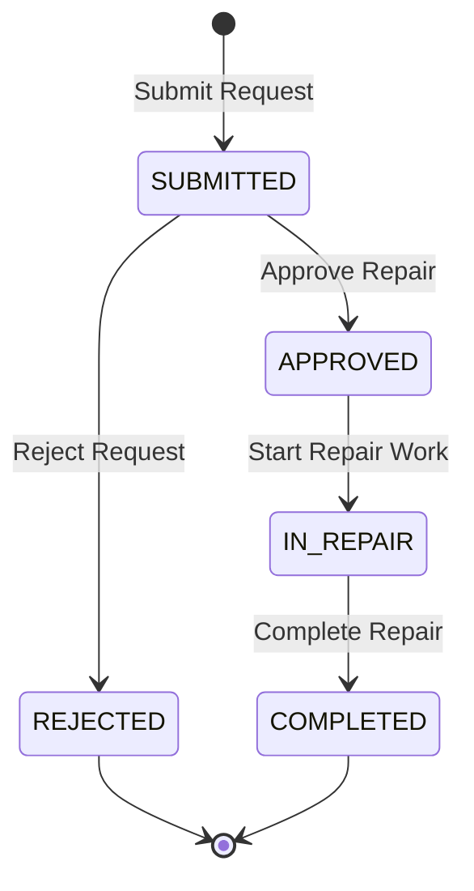
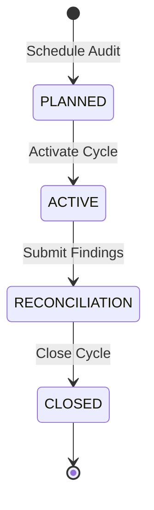
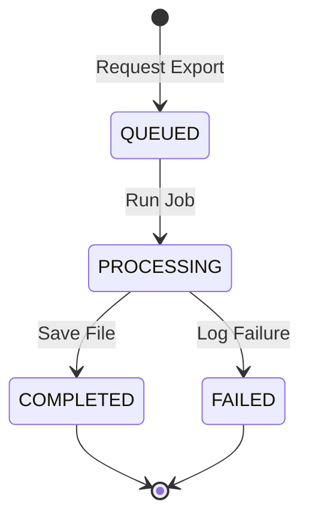
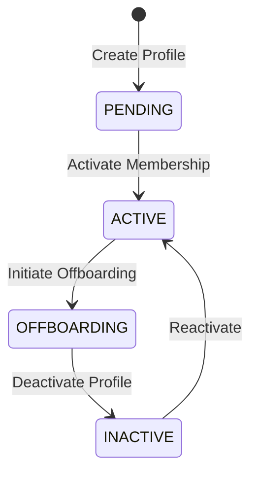

# State Machine Specifications

This document defines the lifecycle states, state transitions, actors, requirements, and side effects for core entities in AssetFlow.

---

## 1. Asset Lifecycle State Machine

Tracks the operational status and custody states of physical hardware.

### State Transitions

| Transition | Actor | Prerequisites | Side Effects | Rejection Conditions | Event Emitted | Idempotency |
|---|---|---|---|---|---|---|
| **Register** | Asset Manager | Asset Tag is unique; category exists. | Sets custody=UNALLOCATED, condition=NEW/GOOD. | Asset Tag already exists in tenant. | `AssetRegisteredEvent` | Deduplicated by client-supplied Asset Tag. |
| **Report Lost** | Employee / Manager | Current state = ACTIVE. | Custody set to UNALLOCATED. Active allocation marked closed. | Asset is already RETIRED or DISPOSED. | `AssetLostEvent` | Idempotent based on asset state check. |
| **Recover** | Asset Manager | Current state = LOST. | Sets condition based on recovery inspection. | Asset is not in LOST state. | `AssetRecoveredEvent` | Checks current status; rejects if ACTIVE. |
| **Retire** | Asset Manager | Current state = ACTIVE. | Releases active allocations. Sets custody=UNALLOCATED. | Asset has pending bookings or active maintenance. | `AssetRetiredEvent` | Idempotent on lifecycle state. |
| **Dispose** | Admin | State is ACTIVE, LOST, or RETIRED. | Releases all custody, deletes active booking links. Terminal state. | Asset has active allocations. | `AssetDisposedEvent` | Rejects if already in DISPOSED. |

---

## 2. Transfer Request State Machine

Tracks custody transfer workflow directly between two Holders.

### State Transitions

| Transition | Actor | Prerequisites | Side Effects | Rejection Conditions | Event Emitted | Idempotency |
|---|---|---|---|---|---|---|
| **Initiate** | Holder / Manager | Current allocation is ACTIVE. | Lock asset state. Creates outbox log. | Asset is currently under maintenance. | `TransferInitiatedEvent` | Prevented by active transfer check. |
| **Approve** | Department Head | Transfer is PENDING_APPROVAL. | Sets state to APPROVED. | Signatory is not the authorized head. | `TransferApprovedEvent` | Deduplicated by transfer request ID. |
| **Reject** | Department Head | Transfer is PENDING_APPROVAL. | Releases asset lock. Sets state to REJECTED. | Approver mismatch. | `TransferRejectedEvent` | Deduplicated by transfer request ID. |
| **Complete** | Target Holder | Transfer is APPROVED. | Deactivates old allocation. Creates target allocation. | Target employee status is not ACTIVE. | `TransferCompletedEvent` | Validated by target allocation state. |

---

## 3. Return Request & Inspection State Machine

Tracks returning an asset to the warehouse.

### State Transitions

| Transition | Actor | Prerequisites | Side Effects | Rejection Conditions | Event Emitted | Idempotency |
|---|---|---|---|---|---|---|
| **Initiate** | Holder | Custody = ALLOCATED. | Creates Return Request ID. | Asset is already UNALLOCATED. | `ReturnInitiatedEvent` | Deduplicated by active allocation ID. |
| **Inspect** | Asset Manager | Return state = INITIATED. | Records condition score (NEW, GOOD, FAIR, POOR, BROKEN). | Asset not in return state. | `ReturnInspectedEvent` | Deduplicated by Return Request ID. |
| **Accept** | Asset Manager | Return state = INSPECTED. | Deactivates allocation. Sets custody = UNALLOCATED. | Inspection record missing. | `ReturnAcceptedEvent` | Sets custody state to UNALLOCATED. |
| **Flag** | Asset Manager | Inspection condition is POOR or BROKEN. | Locks asset. Triggers discrepancy ticket. | Inspection condition is GOOD or NEW. | `ReturnFlaggedEvent` | Deduplicated by Return Request ID. |

---

## 4. Resource Booking State Machine

Tracks reservation scheduling for shared Resources.

### State Transitions

| Transition | Actor | Prerequisites | Side Effects | Rejection Conditions | Event Emitted | Idempotency |
|---|---|---|---|---|---|---|
| **Reserve** | Employee | Resource is available during `TimeRange`. | Locks time range `[start, end)`. | Time range overlaps an existing booking. | `BookingReservedEvent` | Double bookings prevented by PostgreSQL range exclusion. |
| **Confirm** | System / Manager | Status is PENDING. | Confirms reservation. | Confirmation token is invalid or expired. | `BookingConfirmedEvent` | Idempotent by booking status check. |
| **Cancel** | Employee / Admin | Status is PENDING or CONFIRMED. | Releases time range reservation lock. | Booking has already started or completed. | `BookingCancelledEvent` | Idempotent by status check. |
| **Check In** | Employee | Time is within 15 minutes of start. | Transitions status to ACTIVE. | Check-in occurs too early or too late. | `BookingCheckedInEvent` | Deduplicated by check-in token. |
| **Complete** | System / Employee | Status is ACTIVE and end time reached. | Releases resource reservation state. | Booking was already cancelled. | `BookingCompletedEvent` | System cron trigger verifies end time. |

---

## 5. Maintenance Request State Machine

Tracks repairs and servicing workflow.

### State Transitions

| Transition | Actor | Prerequisites | Side Effects | Rejection Conditions | Event Emitted | Idempotency |
|---|---|---|---|---|---|---|
| **Submit** | Employee | Asset state is ACTIVE. | Creates ticket. | Asset is already DISPOSED or RETIRED. | `MaintenanceSubmittedEvent` | Deduplicated by request UUID. |
| **Approve** | Asset Manager | Status is SUBMITTED. | Sets serviceability = UNDER_MAINTENANCE. Creates resource blackout. | Asset is currently allocated to an active transfer. | `MaintenanceApprovedEvent` | Updates status; rejects if already approved. |
| **Start Work** | Technician | Status is APPROVED. | Changes state to IN_REPAIR. | Request is not approved. | `MaintenanceStartedEvent` | Idempotent on state check. |
| **Complete** | Technician | Status is IN_REPAIR. | Sets serviceability = OPERATIONAL. Releases blackout. | Inspection check missing. | `MaintenanceCompletedEvent` | Updates asset dimensions. |

---

## 6. Audit Cycle State Machine

Tracks the compliance inventory audit workflow.

### State Transitions

| Transition | Actor | Prerequisites | Side Effects | Rejection Conditions | Event Emitted | Idempotency |
|---|---|---|---|---|---|---|
| **Schedule** | Compliance Admin | No active audit cycles exist. | Creates cycle target properties. | An active audit cycle already exists. | `AuditScheduledEvent` | Verified by single-active-cycle check. |
| **Activate** | Compliance Admin | Status is PLANNED. | Snapshots all active assets and allocations. | Activation date is in the future. | `AuditActivatedEvent` | Snapshot generated once per cycle. |
| **Reconcile** | Auditor | Status is ACTIVE. | Compiles discrepancy reports. | Unverified audit items remain in list. | `AuditReconciledEvent` | Deduplicated by cycle ID. |
| **Close** | Compliance Admin | Status is RECONCILIATION. | Marks cycle closed. Removes auditor access. | Pending discrepancies lack resolution logs. | `AuditClosedEvent` | Closed state is immutable. |

---

## 7. Export Job State Machine

Tracks report exports to prevent primary DB overload.

### State Transitions

| Transition | Actor | Prerequisites | Side Effects | Rejection Conditions | Event Emitted | Idempotency |
|---|---|---|---|---|---|---|
| **Request** | Employee | Filter schema is valid. | Enqueues job to background worker. | User does not have reporting access. | `ExportQueuedEvent` | Keyed by request timestamp and params. |
| **Run** | Worker | Job is fetched from queue. | Starts DB read replica queries. | Queue lock timeout. | `ExportStartedEvent` | Orchestrated by BullMQ lock. |
| **Save** | Worker | Query returns successfully. | Writes file to S3. Generates pre-signed URL. | S3 storage is unreachable. | `ExportCompletedEvent` | Deduplicated by job ID. |
| **Log Fail** | Worker | Query fails or times out. | Releases queue lock. Stores error stack. | Job was already completed. | `ExportFailedEvent` | Deduplicated by job ID. |

---

## 8. Employee & Membership Lifecycle State Machine

Tracks user identity and access states.

### State Transitions

| Transition | Actor | Prerequisites | Side Effects | Rejection Conditions | Event Emitted | Idempotency |
|---|---|---|---|---|---|---|
| **Create** | Admin / Signup | Signup email is unique. | Creates profile. Defaults role to EMPLOYEE. | Email domain is not white-listed. | `EmployeeProfileCreatedEvent` | Deduplicated by email address. |
| **Activate** | System / Admin | Invite code validated. | Enables JWT login. | Invite code is expired. | `EmployeeActivatedEvent` | Idempotent on status validation. |
| **Offboard** | Admin | Status is ACTIVE. | Flags profile. Triggers return checks. | Employee is the final tenant Administrator. | `EmployeeOffboardingEvent` | Verified by state check. |
| **Deactivate** | System / Admin | All allocated assets returned. | Revokes active JWT logins. | Active allocations remain unreturned. | `EmployeeDeactivatedEvent` | Revokes membership access. |
